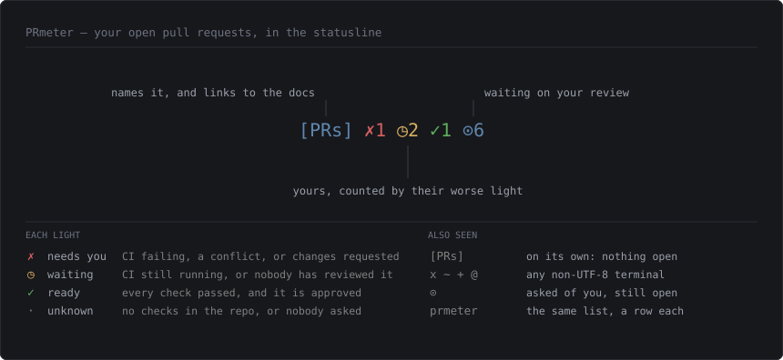

# PRmeter

Your open PRs and what they need, in the Claude Code statusline. One script, one API
call, no daemon.



The label is a link: click it in any terminal that speaks OSC 8 and it opens this page.
`prmeter legend` prints the same key without leaving the terminal, and `prmeter` on its
own opens the whole thing up:

```
⑂ teamsense  2 mine · 1 to review
 mine   ✗· sense-one-d… 274   A text field's limit is a decision, and check:limits finds …
        ✗◷ ts-platform  2403  ATL-4727: fail closed when the send-lease store is unavaila…
 review ✓◷ ts-platform  2432  [points] Relabel a decided event from the employee profile …
```

## What you are looking at

Two lights per pull request. **CI on the left, review on the right.**

|        | CI                        | Review                          |
| ------ | ------------------------- | ------------------------------- |
| **✓**  | every check passed        | approved                        |
| **◷**  | still running             | waiting on a reviewer           |
| **✗**  | failing, or a conflict    | changes requested               |
| **·**  | the repo has no checks    | nobody has been asked yet       |

Shape carries the state as well as colour, so the block still reads in a colourblind
palette, in a pipe, or under `NO_COLOR`.

Two groups: **mine** is what you opened, **review** is what is waiting on you. The label
prints once per group, not once per row. Worst first, so what needs you is at the top.

The segment says the same thing with counts instead of rows — one per light, worst
first, zeros left out, and `⊙` for the ones waiting on your review. `[PRs]` on its own
means nothing is open.

`·` is the honest fourth state. A PR nobody has been asked to review is not "waiting for
approval", and a repo with no CI is not "passing" — inferring either would hide the most
useful thing the block can tell you.

A merge conflict shows as a red CI light. It blocks the merge and it is yours to fix,
which is the same thing a failing check means. When GitHub has not computed mergeability
yet it says so, and PRmeter changes nothing rather than flashing a false alarm.

## Get it

```bash
curl -fsSL https://raw.githubusercontent.com/MarioPayan/PRmeter/main/install.sh | sh
```

Installs the script and wires your statusline. Nothing here overwrites anything: an
existing statusline script is backed up before a line is appended to it, an existing
`statusLine` setting is left exactly as it is, and a second run does nothing.
`--no-wire` installs the script alone and prints the snippet. Short enough to
[read first](install.sh), which you should do with anything you pipe into a shell.


Needs [`gh`](https://cli.github.com) signed in, and [`jq`](https://jqlang.github.io/jq).
PRmeter handles no token of its own: every call goes through `gh`, using the sign-in you
already have.

## Why it is shaped like this

| | |
|---|---|
| **Already on screen** | You never ask. Asking costs a round trip and some context |
| **Not a session hook** | A `SessionStart` hook feeds the *model*, not you — Claude Code prints none of its stdout |
| **One call** | Both lists come from a single GraphQL query, 1 of your 5000/hour |
| **Never waits** | The block is rendered at fetch time and cached as text, so printing it is a `cat` |
| **Never shouts** | No `gh`, no sign-in, no network: it prints nothing rather than an error at every session start |
| **Never lies** | Absent data stays grey, and a cache well past its refresh window says how old it is |

Drafts are filtered by the search itself, so they never leave GitHub.

## Knobs

| | |
|---|---|
| `PRMETER_ORG` | GitHub org to search (default `teamsense`) |
| `PRMETER_REPO_CHARS` | repo name cap (default `12`) |
| `PRMETER_TITLE_CHARS` | PR title cap (default `60`) |
| `PRMETER_LABEL` | what the segment answers to (default `[PRs]`, `""` drops it) |
| `PRMETER_LINK` | where the label points (default this README, `""` unlinks it) |
| `PRMETER_MAX` | rows before `+N more` (default `15`) |
| `PRMETER_REVIEW_FILTER` | extra search terms for the review list (default `-author:app/dependabot`) |
| `PRMETER_TTL` | seconds before the cache is stale (default `300`) |
| `PRMETER_ASCII` | `1` forces ASCII glyphs, `0` forbids the fallback |
| `NO_COLOR` | drop the colour |

`prmeter line` prints the statusline segment, `prmeter` the whole block, and both
refresh behind themselves. `prmeter legend` is this page's table without leaving the
terminal. `prmeter fetch` refreshes now and tells you why if it cannot.

With no PRs, it prints nothing at all.
